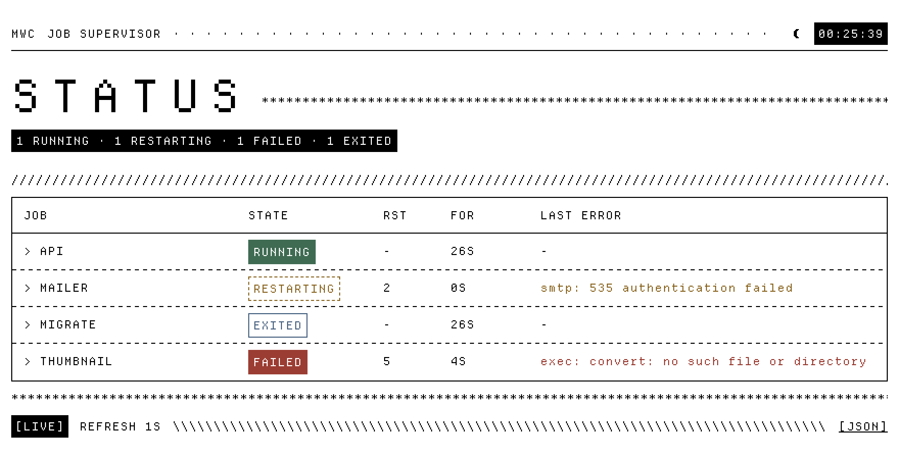

# mwc

A tiny supervisor for long-running Go jobs — servers, workers, pollers.

You hand it a map of named start functions. It starts them all, watches every
one of them, logs the ones that die and restarts them with exponential
backoff. You get back a single `Shutdown` that stops everything gracefully,
and an optional HTML page that shows what is going on.

The core, the health probe and the UI use nothing outside the standard
library. `mwc/metrics` is a separate module, so the Prometheus client it
needs never enters your `go.mod` unless you import it. Go 1.25.

```
go get github.com/dkotTech/mwc
```

```go
m, err := mwc.Start(ctx, map[string]mwc.StartFunc{
	"api":    apiServer,
	"mailer": mailerWorker,
})
if err != nil {
	return err // nothing is left running: a failed Start rolls itself back
}
defer m.Shutdown(context.Background())
```

## Why

A typical service `main` runs three or four things at once: an HTTP server, a
gRPC server, a queue consumer, a cron ticker. Written by hand, that is a pile
of goroutines, channels and `WaitGroup`s in `main`, and when one of them dies
at 4am the process either ignores it or takes everything down with it.

`mwc` is that pile, written once:

- every job is started, and if any job fails to start, the ones already
  running are stopped and `Start` returns the error;
- a job that exits with an error is logged and restarted, with the delay
  doubling after each consecutive failure;
- a job that exits cleanly is left alone — finishing is not a failure;
- a panic inside a job becomes an error instead of a dead process;
- one `Shutdown` stops everything and waits, returning the joined errors;
- cancelling the context passed to `Start` does the same thing.

## The job contract

A job is started by a `StartFunc`. It must return promptly — the actual work
belongs in a goroutine — and it returns a `*Job`:

```go
type Job struct {
	Shutdown func(ctx context.Context) error // graceful stop; may be nil
	Done     <-chan error                    // required: how the job reports its exit
}
```

`Done` is the whole point. `Shutdown` tells the job to stop, but only `Done`
tells the supervisor that the job actually *has* stopped, and why. A job that
crashes on its own never touches `Shutdown`; without `Done` the manager would
have no way of noticing. One value (or a close) means the job is over: a
non-nil error means it failed and will be restarted, `nil` means it finished
and will not be.

For the usual "blocking serve + graceful stop" shape there is a helper:

```go
func apiServer(ctx context.Context) (*mwc.Job, error) {
	ln, err := net.Listen("tcp", ":8080") // bind here, so a busy port fails Start
	if err != nil {
		return nil, err
	}
	srv := &http.Server{Handler: mux}
	return mwc.Run(func() error {
		if err := srv.Serve(ln); !errors.Is(err, http.ErrServerClosed) {
			return err
		}
		return nil
	}, srv.Shutdown), nil
}
```

`Run` runs the function in a goroutine, delivers its result on `Done` and
turns a panic into a `*mwc.PanicError`, so a panicking job is restarted rather
than fatal.

The `ctx` given to a `StartFunc` is that job's own context. It is cancelled
right after `Job.Shutdown` returns, so a job that has no explicit shutdown can
simply watch `ctx.Done()` instead. It is *not* the context passed to `Start`:
jobs are stopped by the supervisor, in order, not by a context racing them.

## States

`Status()` returns a snapshot per job:

| State        | Meaning                                                   |
| ------------ | --------------------------------------------------------- |
| `running`    | up                                                        |
| `restarting` | failed, waiting out the backoff delay                     |
| `exited`     | returned `nil` on its own; not restarted                  |
| `failed`     | failed and the restart limit was exhausted                |
| `stopped`    | stopped by `Shutdown`                                     |

Each entry also carries the number of restarts since the job last ran long
enough to be considered stable, the error behind the last failure (cleared
once the job is running again), and when the state was entered.

Two channels say where the manager itself is: `Done()` closes when no job is
running any more — whether they were stopped or all died — and `Stopping()`
closes when a shutdown has actually been asked for, by `Shutdown` or by the
cancellation of `Start`'s context.

`Healthy()` folds all of that into one answer for a readiness probe: `true`
while every job is `running` or `exited`. A job that is `restarting`, `failed`
or `stopped` makes it `false`, so a process that is shutting down reports
unhealthy and gets taken out of rotation before its ports close. `mwc/health`
serves that answer as HTTP, see below.

To be told about every transition as it happens — for a Prometheus counter, an
alert, an audit log — register a hook:

```go
mwc.WithOnStateChange(func(name string, s mwc.Status) {
	transitions.WithLabelValues(name, s.State.String()).Inc()
	if s.State == mwc.Failed {
		alert(name, s.LastErr)
	}
})
```

It is called with the job's name and new `Status` on start, on each failure
and restart, on exit and on stop. It runs on the job's supervisor goroutine,
so it must return promptly and must not call `Shutdown`; calls for one job
never overlap, calls for different jobs may. It can only watch: there is
deliberately no way to steer a job from outside the process.

## Options

| Option                        | Default | Purpose                                                 |
| ----------------------------- | ------- | ------------------------------------------------------- |
| `WithLogger(*slog.Logger)`    | default | where job start/exit/restart events go                  |
| `WithBackoff(min, max)`       | 1s, 1m  | restart delay: starts at `min`, doubles, capped at `max` |
| `WithMaxRestarts(n)`          | 0       | consecutive restarts per job; 0 means unlimited          |
| `WithStableAfter(d)`          | 1m      | how long a job must run before its restart count resets; 0 never resets |
| `WithShutdownTimeout(d)`      | 30s     | bounds the graceful stop when `Start`'s context is cancelled |
| `WithObserver(fn)`            | —       | watch the running manager until `Stopping()`; `Shutdown` waits for it |
| `WithOnStateChange(fn)`       | —       | called with the name and new `Status` on every state change |

## The UI

`mwc/ui` serves the manager's state as one self-contained HTML page. It is a
single argument to `Start`:

```go
m, err := mwc.Start(ctx, jobs, ui.Serve("127.0.0.1:8080"))
```

<picture>
  <source media="(prefers-color-scheme: dark)" srcset="docs/ui-dark.png">
  
</picture>

The page renders server-side and then refreshes itself every second from
`/api/status`, so it works with JavaScript disabled too (as a static
snapshot). Everything it needs — the stylesheet and the pixel typeface — is
embedded in the binary; it loads nothing from the network. The sun/moon button
switches between light and dark and remembers the choice; without a choice it
follows the system theme.

Routes:

| Route          | Content                              |
| -------------- | ------------------------------------ |
| `/`            | the page                             |
| `/api/status`  | the same data as JSON                |
| `/font.woff2`  | the embedded typeface                |

The UI starts with the manager and stays up until the manager is shut down —
not until the jobs stop, which is when it is worth the most — so by the time
`Shutdown` returns without an error, its port is free. It logs through
`WithLogger` like everything else, and a listen error is logged and otherwise
ignored: the jobs matter, the status page does not.

To mount it on a server of your own instead of giving it a port:

```go
mux.Handle("/jobs/", http.StripPrefix("/jobs", ui.Handler(m)))
```

**The page shows job names and raw error messages.** Bind it to loopback or an
otherwise trusted network; there is no authentication.

## Run it

```
cd example && go run .
```

Two jobs and the status page on <http://127.0.0.1:8080>: an HTTP server that
stays up, and a mailer that fails every five seconds so you can watch the
restart counter and the backoff at work. Ctrl-C stops everything.

The example is a separate module, like `mwc/metrics`, so that `mwc` itself
stays free of dependencies while the demo can have some; `go.work` ties the
three together for development. To test everything:

```
go test ./... ./metrics/... ./example/...
```

 It logs through
[zap](https://github.com/uber-go/zap) to show how any logger is plugged in:
`WithLogger` takes a `*slog.Logger`, and a `*slog.Logger` is just a
`slog.Handler`, which every popular logger ships an adapter for.

```go
zl, _ := zap.NewProductionConfig().Build() // JSON on stderr
log := slog.New(zapslog.NewHandler(zl.Core()))

m, err := mwc.Start(ctx, jobs, mwc.WithLogger(log), ui.Serve("127.0.0.1:8080"))
```

```json
{"level":"error","ts":"2026-09-07T22:28:25.912+0400","msg":"job failed","job":"mailer","err":"smtp: 535 authentication failed","uptime":"5.023684985s"}
{"level":"warn","ts":"2026-09-07T22:28:25.912+0400","msg":"job restart scheduled","job":"mailer","attempt":1,"delay":"1s"}
```

## Health

`mwc/health` is `Healthy()` as an HTTP handler, for a Kubernetes readiness
probe or a load balancer. It is one handler, mounted wherever the application
already listens:

```go
mux.Handle("/healthz", health.Handler(m))
```

It answers `200` with `{"healthy":true}` while every job is up or has finished
cleanly, and `503` with the jobs that are not otherwise:

```json
{"healthy":false,"jobs":[{"name":"mailer","state":"restarting","restarts":3,"lastError":"smtp: 535 authentication failed"}]}
```

Like the status page, it shows job names and raw error messages; expose it to
trusted probes only.

## Metrics

`mwc/metrics` is a [`prometheus.Collector`](https://pkg.go.dev/github.com/prometheus/client_golang/prometheus#Collector)
for the manager, so nobody has to invent metric names on top of
`WithOnStateChange`. It serves nothing by itself: register it in the registry
the application already has, next to its own metrics.

```go
import "github.com/dkotTech/mwc/metrics" // its own module: go get github.com/dkotTech/mwc/metrics

c := metrics.New()
m, err := mwc.Start(ctx, jobs, c.Option())
prometheus.MustRegister(c) // or reg.MustRegister(c) for a registry of your own
```

| Metric                          | Type    | Labels        | Meaning                                                  |
| ------------------------------- | ------- | ------------- | -------------------------------------------------------- |
| `mwc_healthy`                   | gauge   | —             | `Healthy()`: 1 while every job is running or exited cleanly |
| `mwc_jobs`                      | gauge   | —             | number of supervised jobs                                |
| `mwc_job_state`                 | gauge   | `job`,`state` | 1 for the job's current state, 0 for the other four      |
| `mwc_job_state_seconds`         | gauge   | `job`         | seconds since the job entered its current state          |
| `mwc_job_consecutive_restarts`  | gauge   | `job`         | `Status.Restarts`: restarts since the job was last stable |
| `mwc_job_starts_total`          | counter | `job`         | times the job was started, the first start included      |
| `mwc_job_failures_total`        | counter | `job`         | times it exited with an error or failed to start         |

The gauges are read from `Status()` at scrape time. The counters are fed by
the state-change hook, which is what `c.Option()` registers, so a `Collector`
that was not given to `Start` collects nothing. Restarts over the lifetime of
the process are `mwc_job_starts_total - 1`; the consecutive gauge, like
`Status.Restarts`, resets once the job has run for `WithStableAfter`.

## Fonts

The page uses [Departure Mono](https://departuremono.com) by Helena Zhang,
under the SIL Open Font License 1.1; the license ships with the package in
`ui/DepartureMono-LICENSE.txt`.
